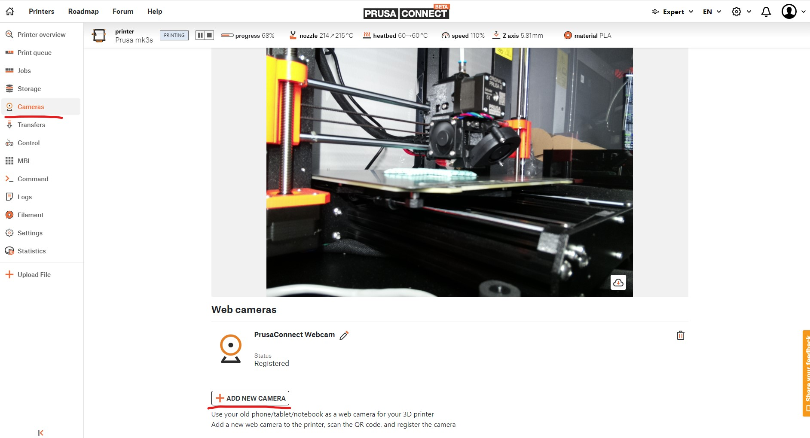
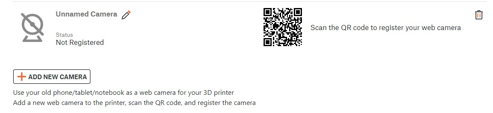
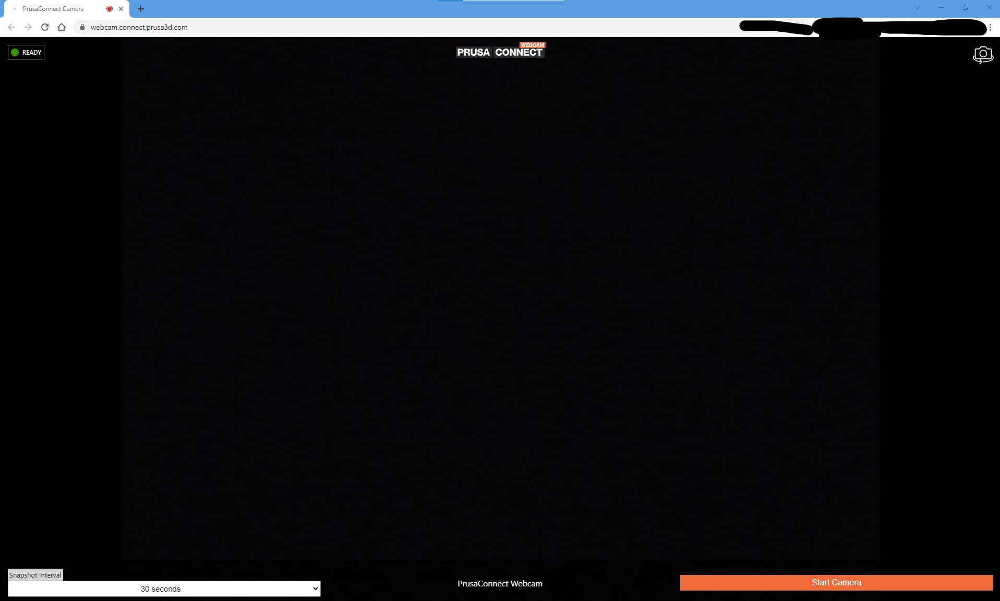
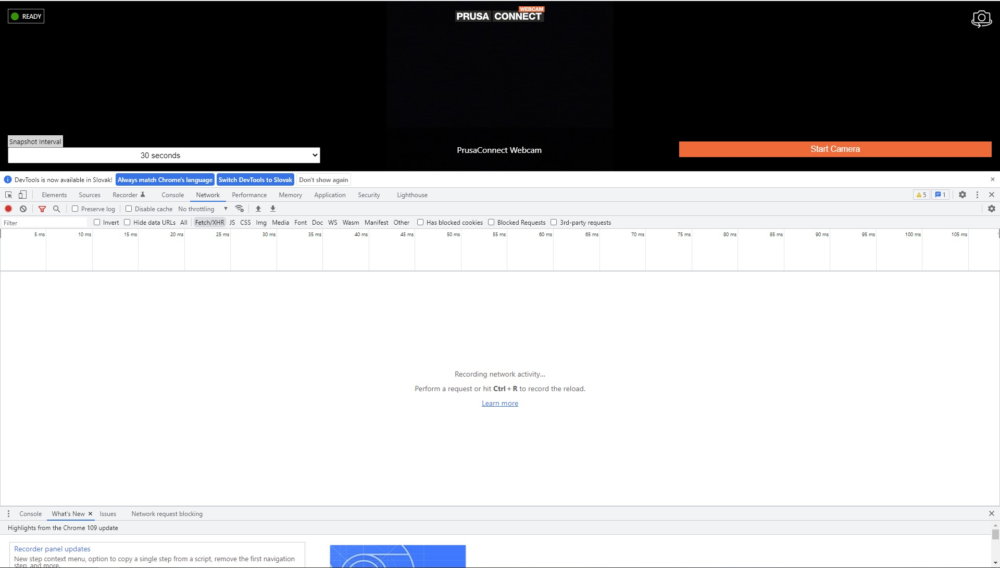
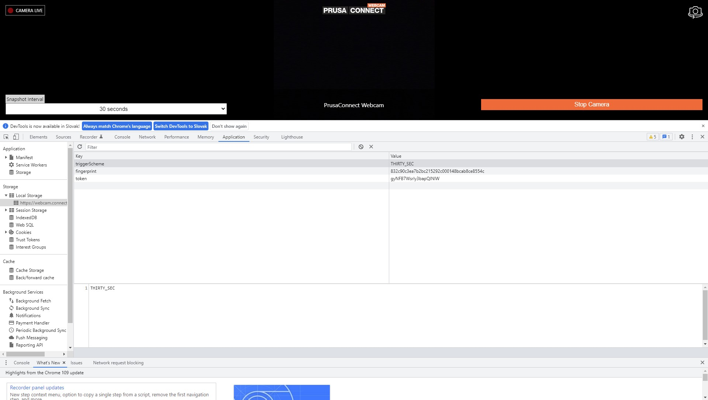
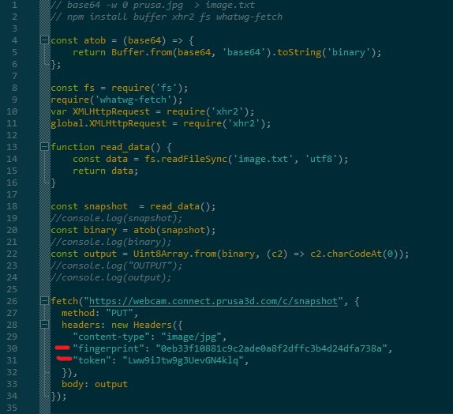

# PrusaConnect_Camera

The script uses an interface to create a camera from an Android/IOS device. A WEB page is launched on the Android/IOS device, which then sending photos from the camera to the prusaconnect backend.

This script uses the same WEB interface. The script is adapted to work in raspberry-pi. For the correct functionality of the camera, it is necessary to obtain a fingerprint and token ID. These variables are only known after creating the camera in the prusaConnect WEB interface. The script uses RPI CSI camera for photo source. So, we need enable CSI camera and connect CSI camera to RPI

# How to enable CSI camera in the linux
1. Type "sudo raspi-config" in the terminal.
```
sudo raspi-config
```
2. then select Interfacing options in which select the camera option to enable its functionality.
3. reboot RPI

# Here is a manual on how to get fingerprint, token ID, and configure script
**Step 1.** Go to [PrusaConnect WEB page](https://connect.prusa3d.com/) . Then in the **left side** click to **Cameras**. And click to **"ADD NEW CAMERA"**



**Step 2.** Next step is click to **QR code**. 



**Step 3.** After click to QR code, is automatically open new window in the browser. (my laptop camera is covered, that's why you see a black screen)



**Step 4.** In the new window, is in the bottom right side button **"Start camera"**. Click to **"Start camera"** and go to **developer mode** in the **browser** (for developer mode in the chrome, we can use F12). 



**Step 5.** Now please go to section **"Application"**, and in the left side section **Storage -> Local Storage -> https://webcam.connect.prusa3d.com** . And here we can see variables **fingerprint** and **token**. **Please copy them**



**Step 6.** Now in the github repository is the file **send_data.js**. Please open him, and update value **fingerprint** on the **line 30** and value **token** on the **line 31**. **And save the file**



**Step 7.** Next step is install all necessary package. Please start script The script installs the necessary libraries
```
sudo chmod +x install.sh
./install.sh
```

**Step 8.** Now we can start script **PrusaConnectCam.sh**. The script takes a photo every 10 seconds using raspistill, and then sends it to the backend of the prusa connect website
```
PrusaConnectCam.sh
```
# Changelog
- 21.2.2023 - Init repository

# TO-DO
- automatic execution of the script with the OS
